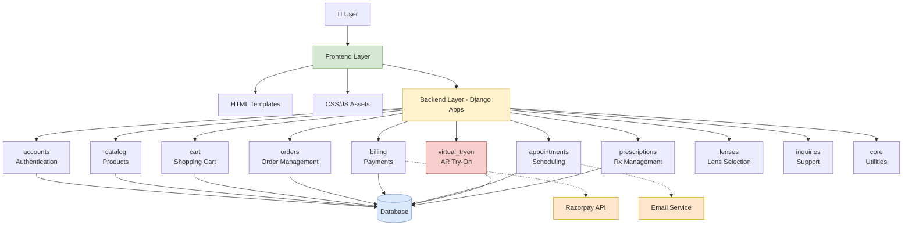
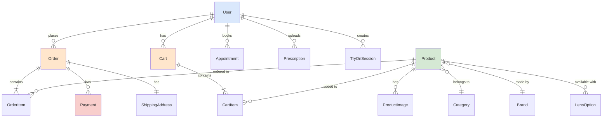
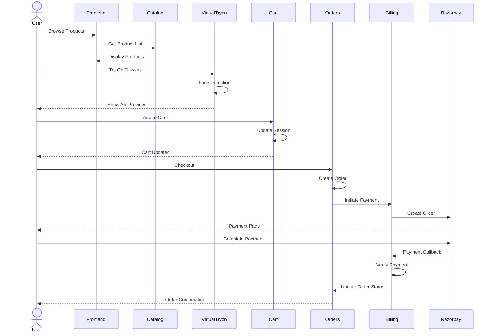
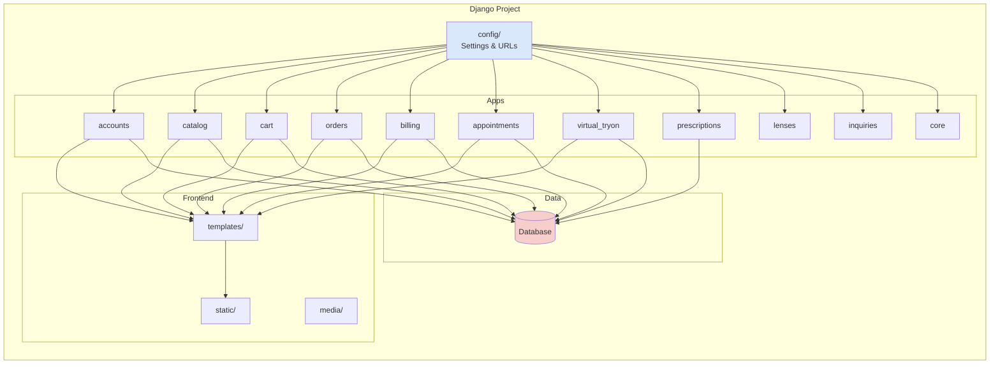
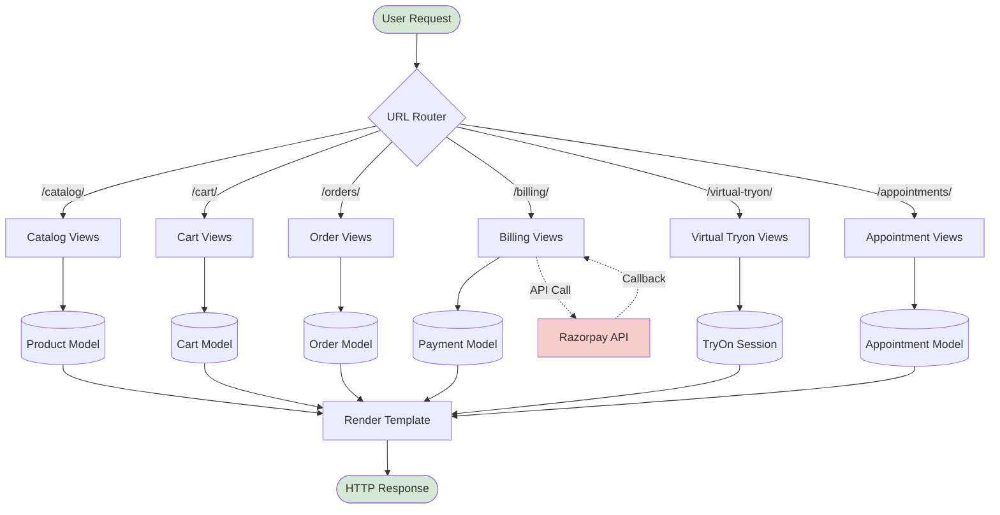
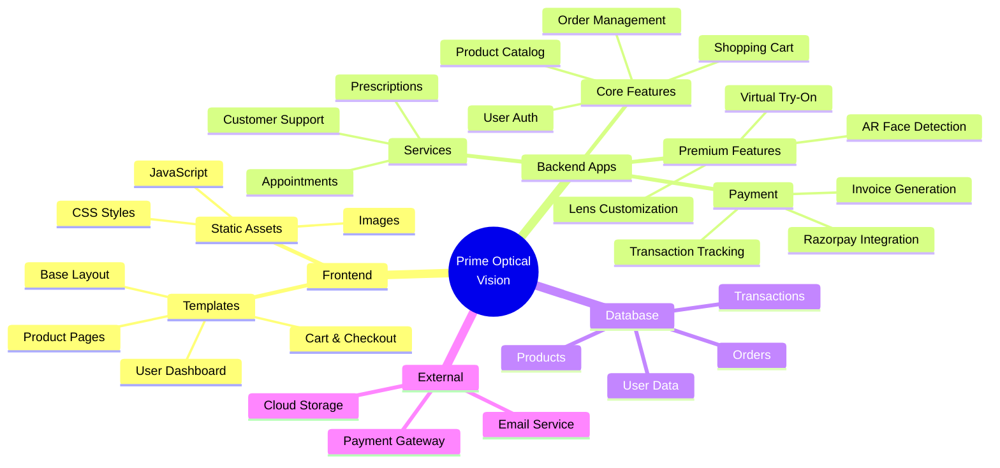
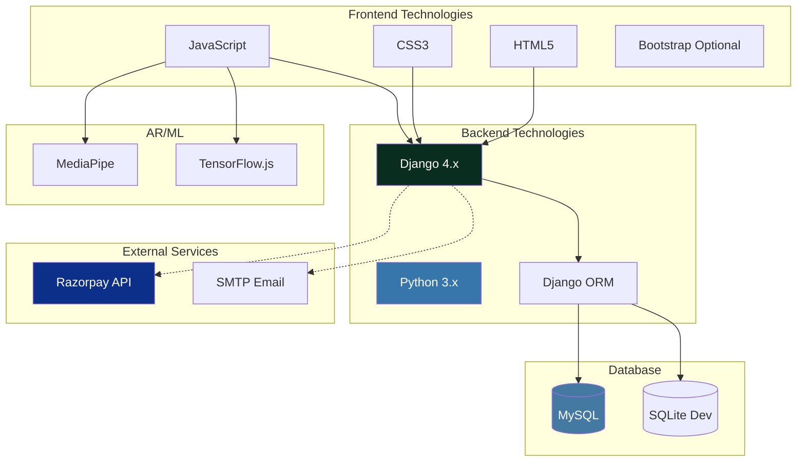
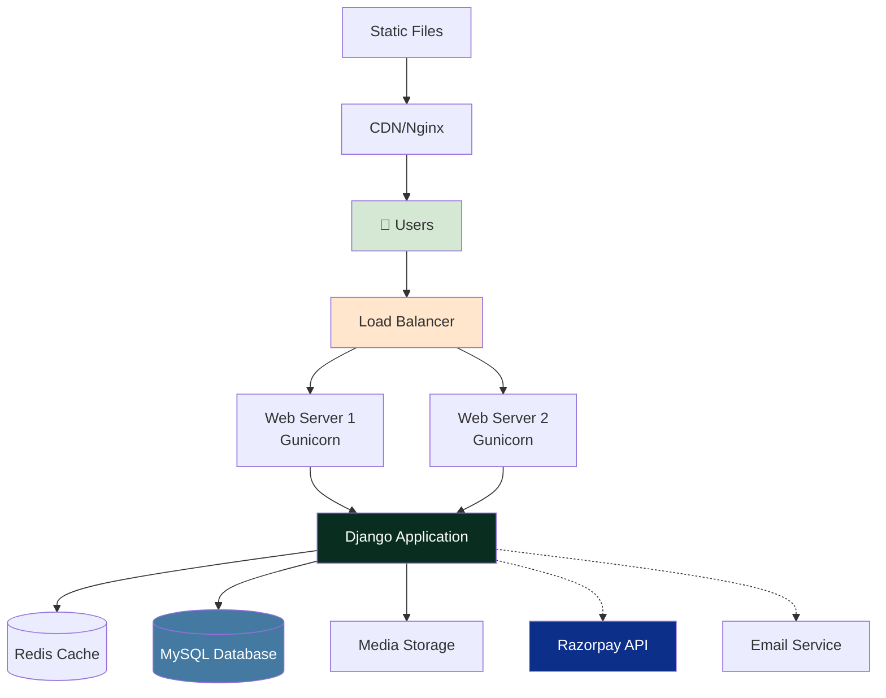

# Prime Optical Vision - Visual Codebase Diagram

## System Architecture Overview



## Database Schema Relationships



## User Journey Flow



## Application Structure



## Data Flow Architecture



## Feature Modules



## Technology Stack



## Deployment Architecture



## File Organization

```
prime-optical-vision/
│
├── 📁 backend/
│   ├── 📁 apps/
│   │   ├── 📦 accounts/         # User authentication
│   │   ├── 📦 catalog/          # Product management
│   │   ├── 📦 cart/             # Shopping cart
│   │   ├── 📦 orders/           # Order processing
│   │   ├── 📦 billing/          # Payment handling
│   │   ├── 📦 appointments/     # Scheduling
│   │   ├── 📦 virtual_tryon/    # AR try-on
│   │   ├── 📦 prescriptions/    # Rx management
│   │   ├── 📦 lenses/           # Lens options
│   │   ├── 📦 inquiries/        # Support
│   │   └── 📦 core/             # Utilities
│   │
│   ├── 📁 config/               # Django settings
│   ├── 📁 templates/            # HTML templates
│   ├── 📁 static/               # CSS, JS, images
│   ├── 📁 media/                # User uploads
│   └── 📄 manage.py             # Django CLI
│
├── 📁 docs/                     # Documentation
├── 📄 requirements.txt          # Dependencies
├── 📄 .env                      # Environment vars
└── 📄 README.md                 # Project info
```

## Key Features Matrix

| Feature | App | Status | Priority |
|---------|-----|--------|----------|
| User Registration | accounts | ✅ Complete | High |
| Product Catalog | catalog | ✅ Complete | High |
| Shopping Cart | cart | ✅ Complete | High |
| Checkout | orders | ✅ Complete | High |
| Payment Gateway | billing | ✅ Complete | High |
| Order Tracking | orders | ✅ Complete | High |
| Virtual Try-On | virtual_tryon | 🔄 In Progress | Premium |
| Appointments | appointments | ✅ Complete | Medium |
| Prescriptions | prescriptions | ✅ Complete | Medium |
| Lens Selection | lenses | ✅ Complete | Medium |
| Customer Support | inquiries | ✅ Complete | Low |
| Search | catalog | 🔄 Basic | Medium |

## API Endpoints Summary

### Authentication
- `POST /accounts/register/` - Register new user
- `POST /accounts/login/` - User login
- `GET /accounts/profile/` - View profile

### Catalog
- `GET /catalog/` - List products
- `GET /catalog/product/<id>/` - Product details
- `GET /catalog/category/<slug>/` - Category products

### Cart & Orders
- `POST /cart/add/` - Add to cart
- `GET /cart/` - View cart
- `POST /orders/create/` - Create order
- `GET /orders/<id>/` - Order details

### Payments
- `POST /billing/create-order/` - Initialize payment
- `POST /billing/verify/` - Verify payment

### Features
- `GET /virtual-tryon/` - AR interface
- `POST /appointments/book/` - Book appointment
- `POST /prescriptions/upload/` - Upload prescription

---

**Generated**: December 27, 2025  
**Version**: 1.0  
**Tool**: Code Diagram Generator
